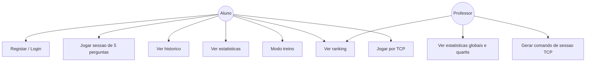
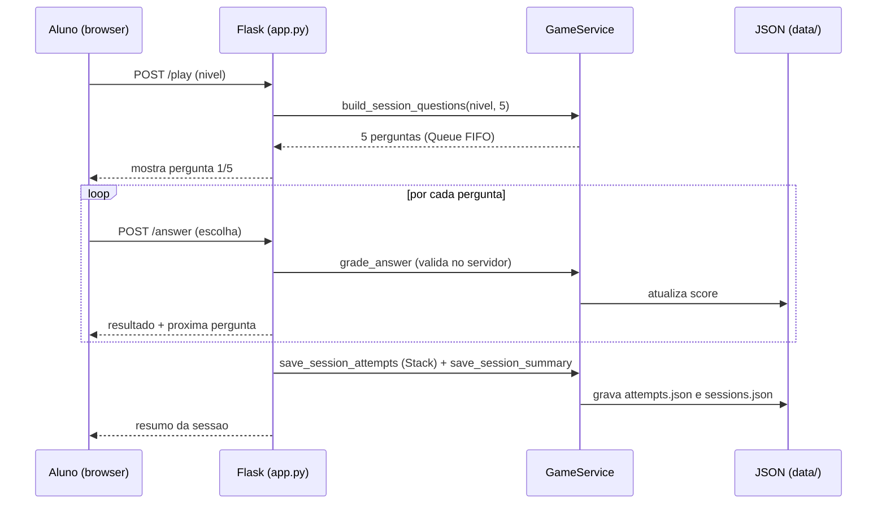
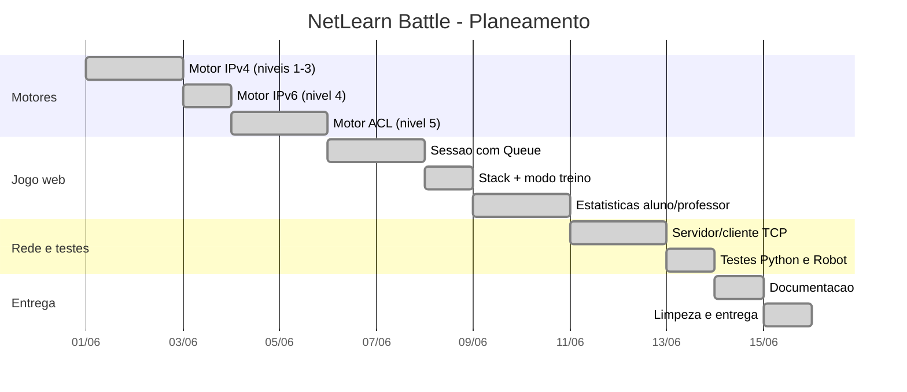

# Diagramas

Diagramas em Mermaid. Podem ser visualizados no GitHub ou em editores que suportem Mermaid.

## Casos de uso

```mermaid
graph TD
    Aluno((Aluno))
    Professor((Professor))

    Aluno --> UC1[Registar / Login]
    Aluno --> UC2[Jogar sessao de 5 perguntas]
    Aluno --> UC3[Ver historico]
    Aluno --> UC4[Ver estatisticas]
    Aluno --> UC5[Modo treino]
    Aluno --> UC6[Ver ranking]
    Aluno --> UC7[Jogar por TCP]

    Professor --> UC8[Ver estatisticas globais e quartis]
    Professor --> UC9[Gerar comando de sessao TCP]
    Professor --> UC6
```

## Fluxo de uma sessão de jogo

```mermaid
sequenceDiagram
    participant A as Aluno (browser)
    participant F as Flask (app.py)
    participant G as GameService
    participant J as JSON (data/)

    A->>F: POST /play (nivel)
    F->>G: build_session_questions(nivel, 5)
    G-->>F: 5 perguntas (Queue FIFO)
    F-->>A: mostra pergunta 1/5
    loop por cada pergunta
        A->>F: POST /answer (escolha)
        F->>G: grade_answer (valida no servidor)
        G->>J: atualiza score
        F-->>A: resultado + proxima pergunta
    end
    F->>G: save_session_attempts (Stack) + save_session_summary
    G->>J: grava attempts.json e sessions.json
    F-->>A: resumo da sessao
```

## Planeamento (Gantt)

```mermaid
gantt
    title NetLearn Battle - Planeamento
    dateFormat  YYYY-MM-DD
    axisFormat  %d/%m

    section Motores
    Motor IPv4 (niveis 1-3)      :done, f1, 2026-06-01, 2d
    Motor IPv6 (nivel 4)         :done, f2, after f1, 1d
    Motor ACL (nivel 5)          :done, f3, after f2, 2d

    section Jogo web
    Sessao com Queue             :done, f4, after f3, 2d
    Stack + modo treino          :done, f5, after f4, 1d
    Estatisticas aluno/professor :done, f6, after f5, 2d

    section Rede e testes
    Servidor/cliente TCP         :done, f8, after f6, 2d
    Testes Python e Robot        :done, f10, after f8, 1d

    section Entrega
    Documentacao                 :done, f11, after f10, 1d
    Limpeza e entrega            :done, f12, after f11, 1d
```
